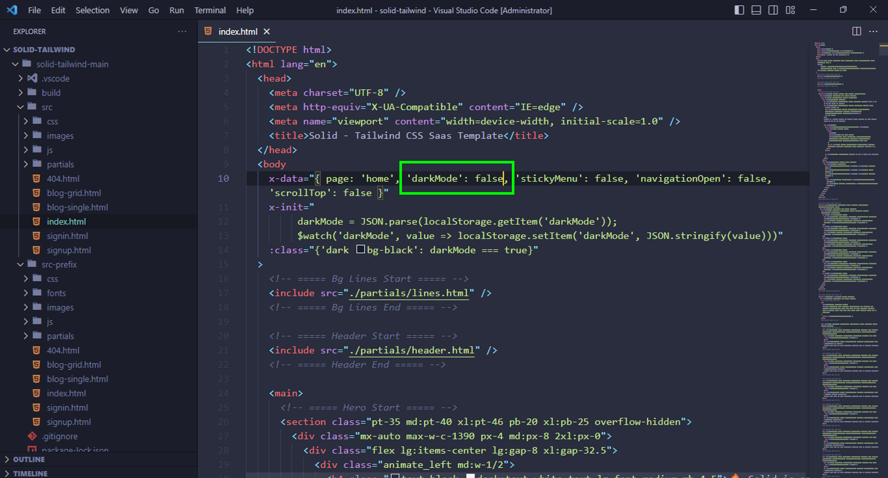
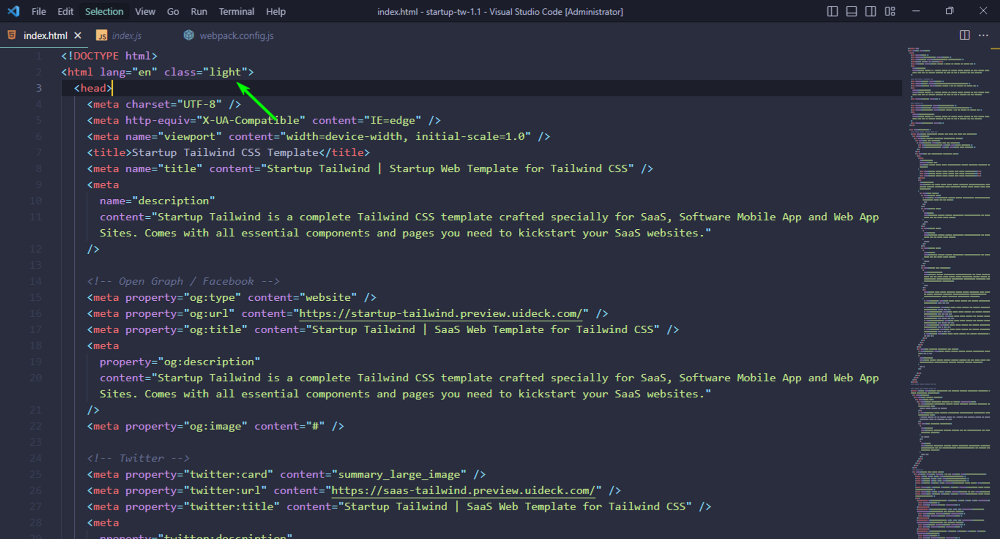
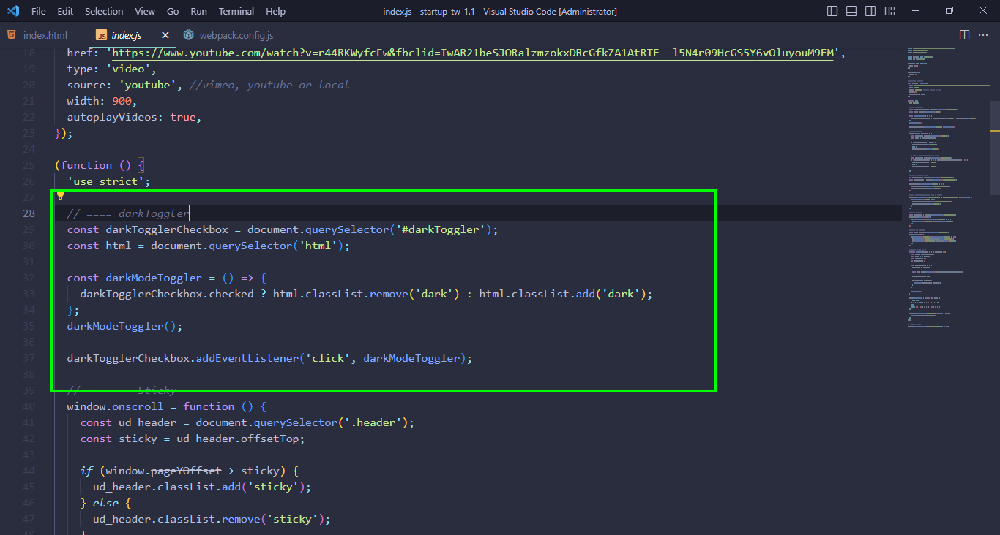

## **Introduction**

This documentation covers the instruction on how to install and use the Tailwind CSS templates, and answers to any problems and issues you may face while using the templates.

If you have any question that is beyond the scope of this documentation feel free to [Open a Support Ticket](https://uideck.com/support/) or reach out to us on [Discord](https://pimjo.com/discord).

We will get back to you ASAP.

The Tailwind templates are built with plain HTML and Tailwind CSS and a few Vanilla JS scripts. And we used Alpine JS for interactions like slider, video, and image popup.

## **Downloading Templates:**

You can download all available templates that are available under the big bundle, by visiting your account.

You can download it anytime you want, as long as you have an account with us.

## **Directory Structure:**

When you download a template and extract it you’ll get a folder that looks like this:

```json
|-- Template Folder
    |-- src
    |    |-- css
    |       |-- All CSS Files
    |    |-- js
    |       |-- All JS Files
    |    |-- images
    |       |-- All Images
    |    |-- partials
    |       |-- HTML Common Sections Like Header, Footer etc
    |    |-- index.html and All HTML Pages Files
    |
    |
    |-- All Config files
```

If you want to customize the template just go to the `src` folder, and you’ll find all the files you need to customize.

## **Installing Templates:**

<iframe
  width="840"
  height="473"
  src="https://www.youtube.com/embed/_fc7DW6_5P0"
  title="YouTube video player"
  frameborder="0"
  allow="accelerometer; autoplay; clipboard-write; encrypted-media; gyroscope; picture-in-picture; web-share"
  allowfullscreen
></iframe>

To use the Tailwind template first we will have to install the dependencies and plugins included in the template.

**Note**: Before we install the plugins make sure you have Node.js installed on your machine. Otherwise, the commands won’t work.

Here are the steps you’ll have to take to install the templates:

**Step#1:** Download the template from UIdeck. When you download the template, you’ll get a zip file.

**Step#2**: Unzip/Extract the zip file. After you’ve extracted it you’ll find all the files and assets you’ll need.

**Step#3**: Now open up the Terminal/Command Line in the project folder. And run this command to install the plugins and the dependencies:

```jsx
npm install
```

It’ll take a few seconds to install. After installation is done, run this command to start the project:

```jsx
npm run start
```

When it starts it’ll automatically open up the project on `[localhost:3000](http://localhost:3000)`.

Now you can change the default content and add your own content, and see the changes on the browser immediately.

## **Deploying to server**

To deploy the Template, you’ll have to generate the `build` folder. You can do that by running this command:

```jsx
npm run build
```

It’ll give you a `build` folder, now you can just upload it on your server and your website will be live.

## **Dark-Light Mode Settings**

Some of our Tailwind templates have a dark mode switcher, here is how you can switch your entire template into single mode (dark or light)

### For Alpine.Js version

**Light mode**

If you want to use the template Light version permanently, you need to just update the **_body tag of All Pages x-data={'darkMode': false}_**.



**Dark mode**

If you want to make dark-mode default, you need to just update the **_body tag of All Pages x-data={'darkMode': true}_**.

And don't forget to remove the toggle button from HTML files.

### For JavaScript version

Switching the modes in JavaScript is a bit different than the Alpine.Js version.

Follow these steps to switch the modes.

**Light mode**

To make the light mode the default theme you have to add the “light” class to the html.



After that, you have to remove the theme switcher code from the js file.



Note: The theme switcher code in the js file may vary from template to template. Just make sure to remove all the codes that are for the theme switcher.

And at the end remove the theme switcher button from the header.

**Dark mode**

For the dark mode, the process is the same. All you have to do is add the “dark” class on the html and follow the rest of the steps from above.
